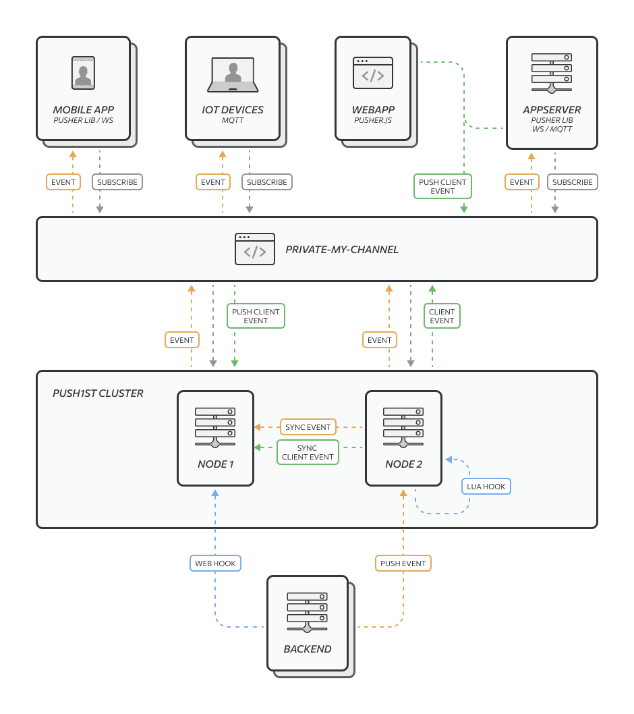

# NavekSoft Push1ST
Push1ST is open source PUB/SUB multiple protocol message broker server ([Pusher](https://pusher.com/), MQTT, RAW WebSocket) 

<p align="center">

</p>

## Key features
 - [x] Suitable for distributed one-to-many communications and distributed applications 
 - [x] Cross type channel messaging ( auto casting message between channel protocol format )
 - [x] Broadcast, Multicast, Unicast - message delivery, 
 - [x] Muti-applications support ( credentials for every app )
 - [x] Improved hooks  ( multiple http/https webhooks, lua hook, for every app, triggered by register, unregister, join, leave or push into channel )
 - [x] Support multiple protocols 
   - [x] Pusher
   - [x] Raw WebSocket ( with multiple channel subscription )
   - [ ] MQTT protocols (todo)
 - [x] Support HTTP Pipelining for API and WebHook
 - [x] Public, Private, Presence channels support
 - [x] Permanent or auto-closing channel 
 - [x] Cluster functionality
   - [x] Register\Unregister channel
   - [x] Join\Leave subscriber
   - [x] Cross nodes message delivery
   - [x] Extending cluster functionality via Lua script
   - [ ] Presence user synchronization
 - [x] API Pusher format support with TCP or\and UNIX socket
 - [x] API access token, Pusher key generation, channels API
 - [x] Support WebSocket push messaging (broadcast, multicast, unicast )
 - [x] Websocket channel authorization by Bearer access token
 - [ ] IP whitelist for every enabled protocol
 - [x] TCP/IP as basic communication protocol
 - [x] WS/WSS proto ( auto generate self-signed certificate if cer\key not specified )
 - [x] Support for websocket sessions prefix naming ( can be use for multicast message pushing )


## Installation guide

Install from APT ( Ubuntu, Debian ) repository [installation guide](/readme/installation.md).

Build from source code [build instruction](/readme/build.md).

## Run push1st server

After install or build Push1ST your can configure server ( [Configure push1st](/readme/configure.md) ). Default Push1ST installed into /opt/naveksoft/push1st and register as systemd service. ( Service not start automatically. You must run service manuall, after each install.)


```bash
  sudo service push1st start
```
 
 Run Push1ST from command line  ( not as service )

```bash
  /opt/naveksoft/push1st/push1st -c /opt/naveksoft/push1st/server.yml -V4
  
  # See command line params
  /opt/naveksoft/push1st/push1st --help
  
```

## Usage and API 

Для подключения клиентов к каналам необходимо воспользоваться библиотеками:
- [Pusher client libraries](https://pusher.com/docs/channels/channels_libraries/libraries/)
- Any WebSocket client for Raw WebSocket

ws://localhost:6001/pusher/app/`{{app-key}}`/ or ws://localhost:6001/app/`{{app-key}}`/ 

ws://localhost:6001/ws/app/`{{app-key}}`/`{channel-name-1}`/`{channel-name-2}`/[?`session=prefix`&`token=access-token`]

see [Python examples](/readme/example.md)

see [Push1ST API](/readme/api.md)

## Support
 Push1ST is our open source project supported by a small group of people. We do not offer formal support processes. If you require formal support arrangements please email us. [info@naveksoft.com](mailto:info@naveksoft.com?subject=Push1ST,GITHUB)

## Author 

## License
 [Apache-2.0 License](/LICENSE)

Copyright (c) 2021 Naveksoft.

This project is provided as is without any warranties. Use at your own risk.<br/>
By using Push1ST you agree with its [privacy](PRIVACY.md) policy and [license](LICENSE.md).
